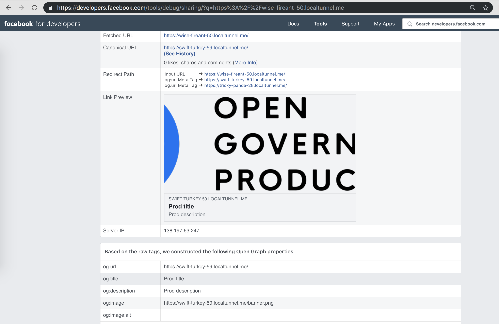
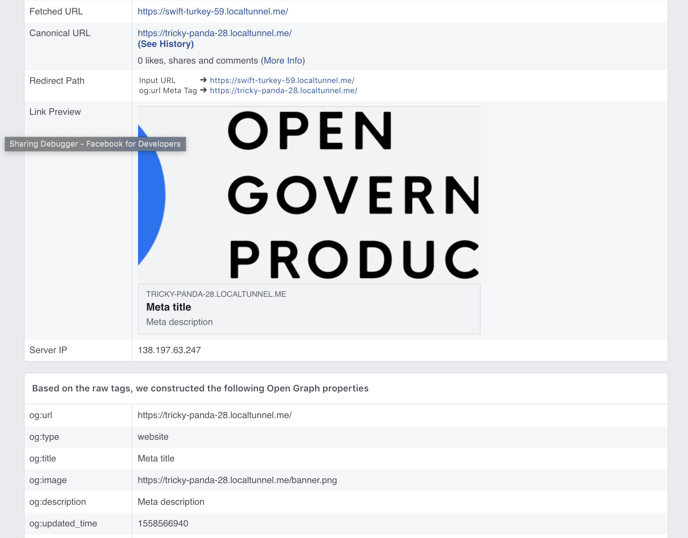
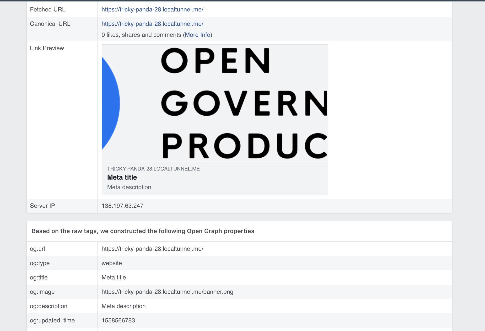

Run the three servers
`node prod.js` 
`node meta.js`
`node ndp.js`

Install localtunnel to expose your ports
`npm i -g localtunnel`

Expose 8091 for prod
`lt --port 8091`
https://swift-turkey-59.localtunnel.me

Expose 8092 for meta
`lt --port 8092`
https://tricky-panda-28.localtunnel.me

Expose 8093 for ndp
`lt --port 8093`
https://wise-fireant-50.localtunnel.me

Set up the og:url tags so that prod points to meta, and ndp points to prod

We expect that the FB og debugger will show

For NDP:
Prod title
Prod description
Prod image 

For Prod:
Meta title
Meta description
Meta image

For Meta:
Meta title
Meta description
Meta image

Behaved as expected.
*NDP*

*PROD*

*META*

